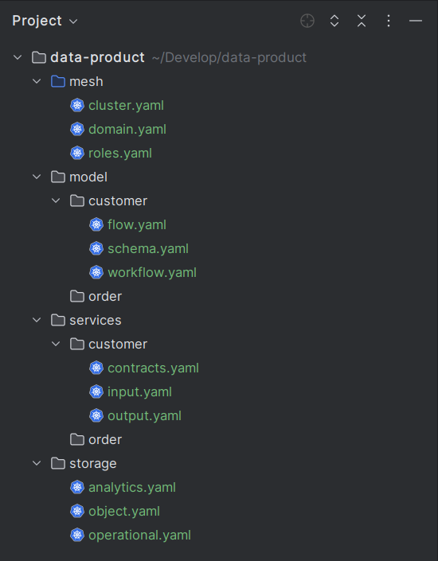
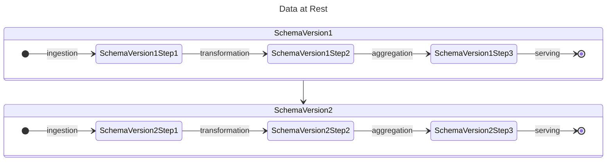
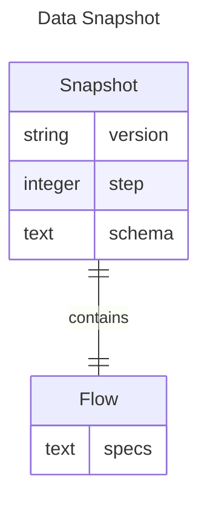
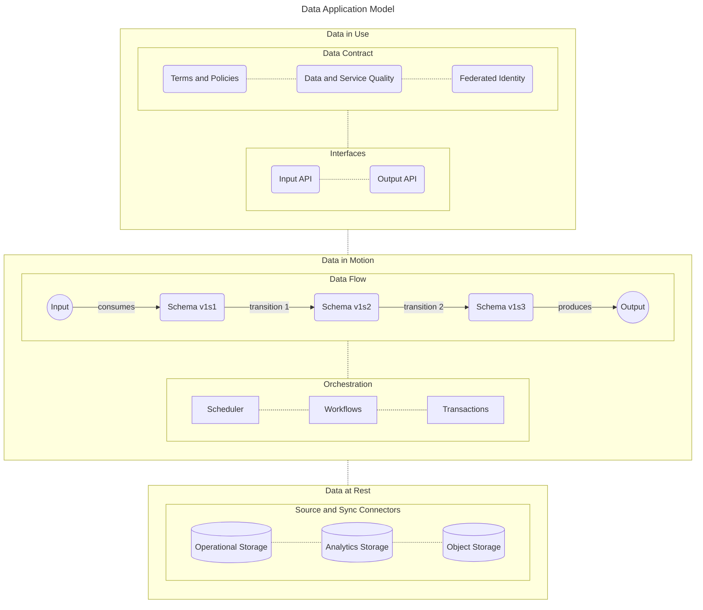

# Data Application Model Framework

The DappMesh Application Model enables developers and data engineers to declaratively create cloud-native data product applications, inspired by Kubernetes' powerful capabilities and infrastructure-agnostic approach.
Similar to how Kubernetes provides CNI (Container Network Interface) and CSI (Container Storage Interface) APIs to ensure compatibility across different network and storage providers, DappMesh is designed to be infrastructure-agnostic. This flexibility ensures that DappMesh can seamlessly integrate with various underlying platforms.

Using the DappMesh CLI, a user can define, deploy and orchestrate the entire lifecycle of a data product within a structured project hierarchy, such as the simplified example provided below:

The following section explains how the DappMesh application model integrated the concept of a data quantum into the platform architecture.
Each data quantum in DappMesh encapsulates not only the domain-specific data but also the code required for governance, orchestration, transformation, and integration.

## Data Quantum

According to Zhamak Dehghani's definition in the book [Data Mesh](https://learning.oreilly.com/library/view/data-mesh/9781492092384), *"a data quantum is the foundational unit of a data mesh architecture. It holds the domain-oriented data and the code that performs the necessary data transformations and shares the data and the policies governing the data."*

Equivalently, the declarative model of DappMesh adjust this concept through the following elements:

### 1. Data at Rest

- **Schema Versioning:** Each version of the data schema represents a specific moment in its evolution until the current or active version.

- **Schema Lineage:** It represents each state after a transition process, like ingestion, transformation, enrichment, merge, aggregation, etc.

### 2. Data in Motion

- **Data Flow:** It is a Direct Acyclic Graph (DAG) that describes the sequence of activities that transforms the schema from the current state $S_{n}$ to the next state $S_{n+1}$.

- **Data Workflow:** A set of activities, retry policies, timers, triggers, and schedulers to orchestrate resilient data pipelines and distributed transactions.

- **Data Snapshot:** In our implementation of the Data Quantum concept, a snapshot is defined as the state of the data in rest described by the schema of version *x*, the current moment *y* in the sequence of transitions, and the flow that brought the data to the current state.

### 3. Data in Use

- **Data Input Interfaces:** Integration connectors for external data sources, data products within the same mesh, and external data products. In addition, the data product interface includes the microservices APIs (GraphQL, REST, gRPC, etc.) to handle operational data transactions.

- **Data Output Interfaces:** Provides operational and analytics data sharing through microservices APIs (GraphQL, REST, gRPC, etc.). Also, it may accept federate access that allows clients to consume from the storage infrastructure.

- **Data Contract:** As specified by the [Data Contract Specification](https://datacontract.com), *"a data contract is a document that defines the structure, format, semantics, quality, and terms of use for exchanging data between a data provider and their consumers"*.

### 4. DappMesh Application Model

The core application model is essentially data-centric and encompasses all possible states (data in rest) and the transitions between them (data in motion). Additionally, it defines the input and output interfaces, as well as the governance norms and policies established by data contracts (data in use).

