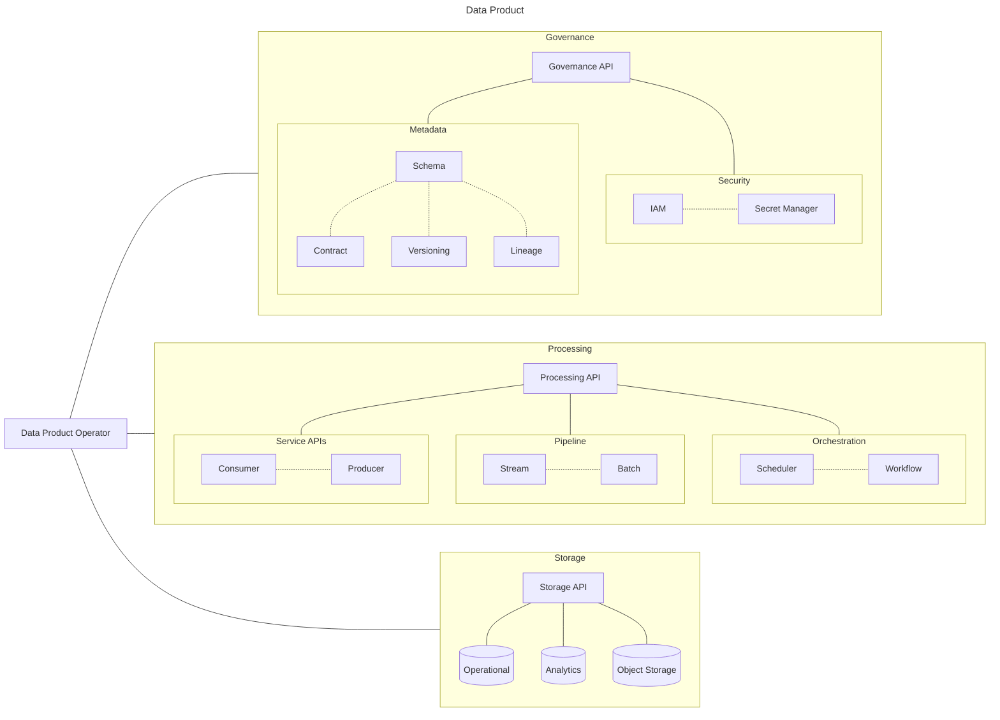

# Data Product Architecture

According to the [Data Mesh](https://learning.oreilly.com/library/view/data-mesh/9781492092384) book by Zhamak Dehghani, a data product "is the smallest unit of architecture that can be independently deployed and managed".
The DappMesh [Data Application Model Framework](./application-model.md) abstracts the structural and logical components of data product architecture in terms of Kubernetes custom resources.

## 1. Governance Layer

### 1.1. Logical Components

- **Security:** Uses custom resources to define users, roles, policies, secrets, tokens, and certificates.

- **Metadata:** It holds the fundamental data quantum unit as the [Data Application Model's](./application-model.md) core. To this end, it specifies a set of CRDs to describe every possible state of the data (schema, lineage, and versioning), the transitions between states (data flow and orchestration), and the data contracts for producers and consumers.

### 1.2. Structural Components

- **Security:** Managed by Kubernetes APIs and cloud-native applications such as network policy, encryption, cert-manager, cloud IAM, and cloud key vault.

- **Metadata:** Stored in the cluster-wide metadata distributed database ([SurrealDB](https://surrealdb.com)).

## 2. Processing Layer

### 2.1. Logical Components

- **Pipeline:** Stream and batch pipeline CRDs can reference the pre-defined core processing API, create custom SQL transforms, and link custom code repositories into declarative flows.

- **Orchestration:** Declaratively define DAGs, triggers, flows, and complex distributed transactions.

- **Service APIs:** Generate producer service APIs from data contracts and schema metadata. Ingest from consumer custom resources to enforce data contracts and take advantage of automated schema drift.

### 2.2. Structural Components

- **Pipeline:** Unified stream and bach ingestion, CDC, and ETL provided by [Estuary](https://estuary.dev/product). Cloud-native stream processing with [Arroyo](https://www.arroyo.dev).

- **Orchestration:** Schedule workflows, create durable state business logic and code fault-tolerant activities with [Temporal](https://temporal.io).

- **Service APIs:** Generate stream, gRPC, and REST data producers/consumers using Rust libraries. Data capture using log-based CDC and 100+ built-in [Estuary](https://estuary.dev/product) connectors.

## 3. Storage Layer

### 3.1. Logical Components

- **Operational Data:** Transactional distributed databases, including SQL, NoSQL, and multi-model data stores. 

- **Analytical Data:** Distributed real-time data warehouse and transactional data lake platform. 

- **Object Storage:** Cloud-native S3 compatible object store.

### 3.2. Structural Components

- **Operational Data:** [TiDB](https://www.pingcap.com/tidb) as the standard distributed SQL database. It is intended to evolve towards multiple connectors and agnostic APIs that support SQL (PostgreSQL, CockroachDB), NoSQL (Cassandra, MongoDB), multi-model (SurrealDB, YugabyteDB), and others.

- **Analytical Data:** [Apache Doris](https://doris.apache.org) real-time data warehouse and [Apache Hudi](https://hudi.apache.org) transactional data lake platform.

- **Object Storage:** [MinIO](https://min.io) S3 compatible object store.
