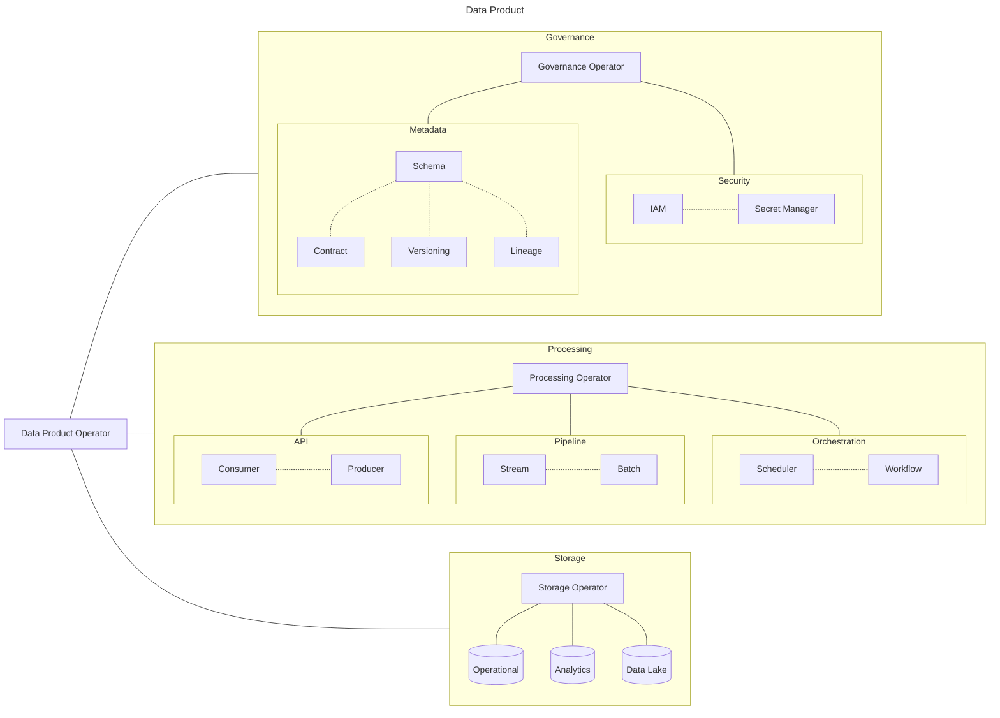

# Data Product Architecture

```mermaid
---
title: Data Product 
---
flowchart LR

    subgraph governance[Governance]
        direction TB

        subgraph security[Security]
            direction LR
            
            iam[IAM] -.- vault[Secret Manager]
        end

        subgraph metadata[Metadata]
            direction TB
            
            schema[Schema] -.- contract[Contract]
            schema[Schema] -.- versioning[Versioning]
            schema[Schema] -.- lineage[Lineage]
        end
        
        governanceOperator[Governance Operator] --- security
        governanceOperator[Governance Operator] --- metadata
    end 

    subgraph processing[Processing]
        direction TB

        subgraph pipeline[Pipeline]
            direction LR

            stream[Stream] -.- batch[Batch]
        end

        subgraph orchestration[Orchestration]
            direction LR

            scheduler[Scheduler] -.- workflow[Workflow]
        end

        subgraph api[API]
            direction LR

            consumer[Consumer] -.- producer[Producer]
        end

        processingOperator[Processing Operator] --- pipeline
        processingOperator[Processing Operator] --- orchestration
        processingOperator[Processing Operator] --- api
    end

    subgraph storage[Storage]
        direction TB

        operationalDatabase[(Operational)]
        analyticsDatabase[(Analytics)]
        dataLake[(Data Lake)]

        storageOperator[Storage Operator] --- operationalDatabase
        storageOperator[Storage Operator] --- analyticsDatabase
        storageOperator[Storage Operator] --- dataLake
    end

    operator[Data Product Operator] --- governance
    operator[Data Product Operator] --- processing
    operator[Data Product Operator] --- storage
```