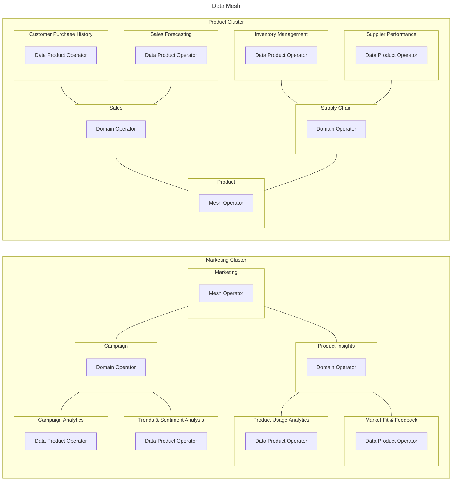

# Composite Operator Mesh

In its simplest form, DappMesh can be set up on a single Kubernetes cluster. For more complex use cases, it can be deployed in a multi-cluster architecture.

The goal of using the [Kubernetes Operator Framework](https://operatorframework.io/) to provision DappMesh custom resources is to automate management activities (installation, configuration, update, backup, failover, restore, etc) by integrating natively with Kubernetes APIs.

For this purpose, we are using [kube.rs](https://kube.rs/), a [Rust](https://www.rust-lang.org/) client and controller-runtime for Kubernetes, hosted by [CNCF](https://www.cncf.io/).

- **Mesh Operator:** It is responsible for managing the metadata database and provisioning the core infrastructure, such as the service mesh, certificate manager, key vault, identity management, and monitoring system. Additionally, it can synchronize inter-mesh metadata in multi-cluster scenarios.

- **Domain Operator:** An admission controller enforces the governance, security, policies, and validation of domain custom resources within the mesh. Similarly, the domain operator manages governance over data products within the domain.

- **Data Product Operator:** This operator manages the [application model's](./application-model.md) custom resources, such as schemas, contracts, and flows. Additionally, it provisions and controls the product infrastructure, including storage (operational, analytics, object storage) and processing (pipelines, orchestration, service APIs).

