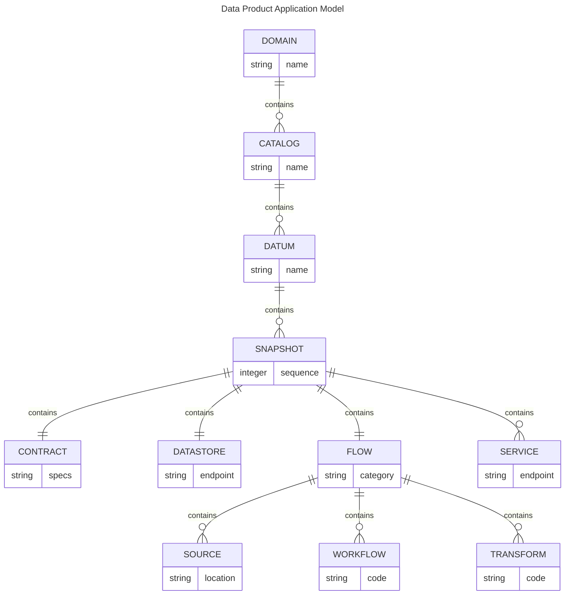

# Data Product Application Model

The Data Product Application Model consists of an abstraction layer that implements the principles of data mesh’s logical architecture and operating model.

## Principles

1. Domain Ownership
2. Data as a Product
3. Self-Serve Data Platform
4. Federated Computational Governance

## Datum Definition

According to the book [Building Evolutionary Architecture (O’Reilly)](https://learning.oreilly.com/library/view/building-evolutionary-architectures/9781492097532/), an *architectural quantum* is the smallest unit of architecture that can be independently deployed, has high functional cohesion, and includes all the “structural elements required for its function.”

Similarly, we can think of a Datum as the smallest logical unit that describes all states (schemes, contracts) and transitions (lineage, transformations) of a data set in a data product.

## The Model

## Data Product as a Kubernetes Application

The seed idea is that a Data Product can be deployed as a Kubernetes Application. For example, the application project can be declaratively defined in yaml files and packaged as a Helm Chart.

The [Kubernetes Operator Framework](https://operatorframework.io/) can be used to manage, monitor, and scale the Data Product resources in a multi-tenant cluster.

## Resources 

[Kube-rs](https://kube.rs/) - Rust implementation of the Kubernetes Operator Framework