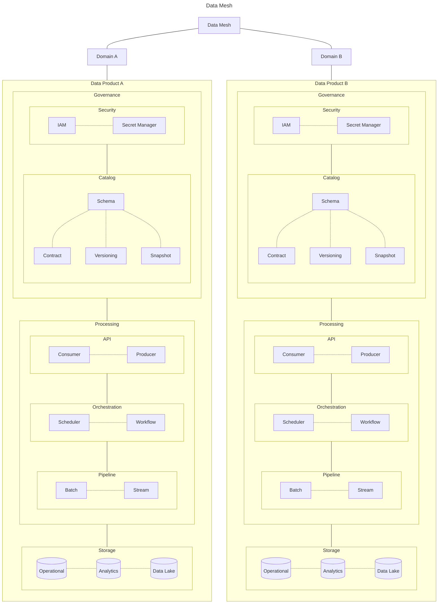

# Architecture

## Entity Component System (ECS)

> *An ECS comprises entities composed from components of data, with systems which operate on entities' components.*
*ECS follows the principle of composition over inheritance, meaning that every entity is defined not by a type hierarchy, but by the components that are associated with it. Systems act globally over all entities which have the required components.*
[...]
*Common ECS approaches are highly compatible with, and are often combined with, data-oriented design techniques. Data for all instances of a component are commonly stored together in physical memory, enabling efficient memory access for systems which operate over many entities.*
[^1]

### Simple instruction multiple data (SIMD)
In a system that favors composition over inheritance we can maybe[^2] apply SIMD, which is a type of parallel processing used for data intensive efficient computations.[^3] 

[^1]: source: [Wikipedia](https://en.wikipedia.org/wiki/Entity_component_system)
[^2]: this is my intuition based on hobby level graphics and sound programming knowledge. These are two fields where SIMD is widely used to tune performance at the machine level.
[^3]: see the [*Energy Efficient Programming*](https://open.hpi.de/courses/cleanIT-x862022) online course.
