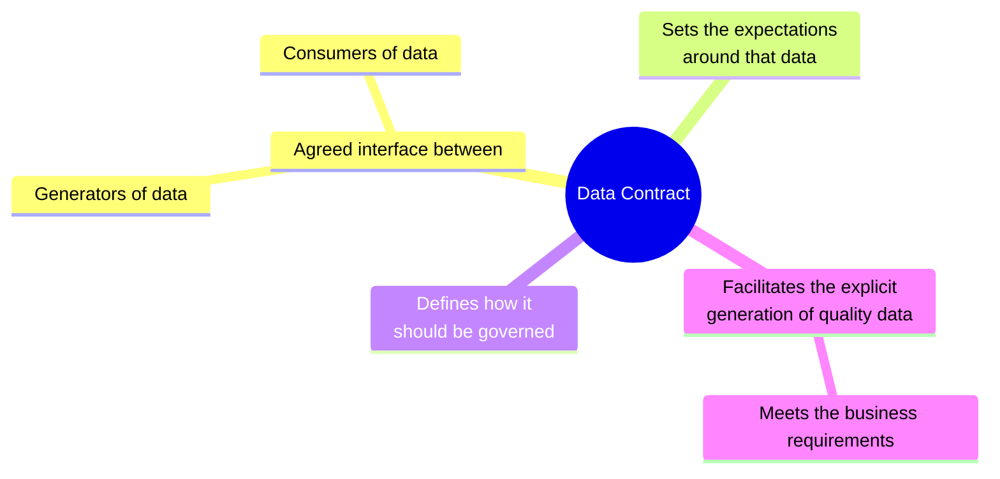

# Data Contract

```mermaid
mindmap
	root((Data Contract))
		Agreed interface between
			Generators of data
			Consumers of data
		Sets the expectations<br/>around that data
		Defines how it<br/>should be governed
		Facilitates the explicit<br/>generation of quality data
			Meets the business requirements
```