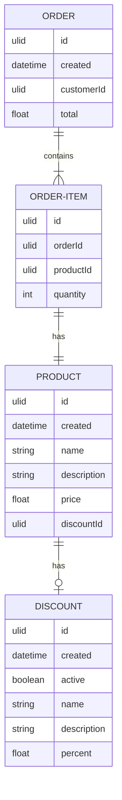

# Data Product

TODO

## Example



## Challenges:

- Data producers need to be able to change the schema of the database.
  - Autonomy to deliver product features.
  - Data engineers should not slow them down reviewing each change. 
  - Data consumers must accept regular schema changes. 
  
- Data pipelines are becoming more complex as we handle changes.
  - Hard to reason with.
  - Loss of confidence when making changes.
  
- Users are losing trust in the data.
  - Unsure whether they can rely on it.

- Lack of confidence prevents the effective use of this data.
  - It's not being used to drive decisions.
  - Leading to worse business performance.

## Moving to a Data Product aims to solve:

- Data generators explicitly supply data through a new interface.
  - Decouples consumers from internal models.
  - Allowing to make changes without affecting downstream consumers.

- Data provided through the data product meets the requirements of the consumers.
  - Reduces the amount of work needed in the data pipelines.
  - Transformations are simpler and easier to understand.

- Reduction in complexity increases the reliability of pipelines.
  - Easier to find and fix problems.

- Data products set clear expectations on the performance and dependability of the data.
  - Data engineers can set similar expectations for their users.
  - Expectations allow users to trust the data.

- Use the data to support better decision-making.
  - Leads to better business outcomes.

## Sample schema for this Data Product:

```yaml
description: An event generated when an order is created
owner: domain-product@datadiver.cloud
version: 1
slos:
  completeness_percent: 100
  timeliness_mins: 60
  availability_percent: 95
storage_path: order_events
fields:
  id:
    type: string
    description: The unique identifier for the order
  created_at:
    type: timestamp
    description: The date and time the order was created
  items:
    type: array
    fields:
      product_id:
        type: string
        description: The unique identifier for the product
      price:
        type: float
        description: The price of the product, in cents
      quantity:
        type: integer
        description: The amount of this product ordered
      discount_id:
        type: string
        description: The unique identifier for the discount
      discount_percent:
        type: float
        description: The percentage discount applied to this item, represented as a number between 0 and 1
  order_total:
    type: float
    description: The total cost of the order, in cents
```